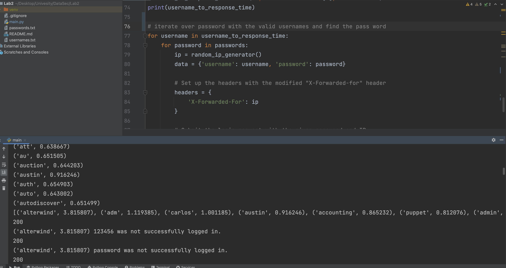

# username-enumeration-via-response-timing
This repository is solution to assignment on Data Security Course. It is a portswigger [Lab](https://portswigger.net/web-security/authentication/password-based/lab-username-enumeration-via-response-timing) which was assigned to me to solve.

# Description

I have provided comments on code, and it is much more clear that I prefer not to over explain them. But here some tips I wanna explain:

1. Implemented a statistics approach to distinguish between usernames.
3. Used random ip generator.

# Result

Although I found the username with high response time, but none of the password provided didn't
work, and I was not able to sign in.

You can observe that the script found the usernames in sorted array based on response-time.

